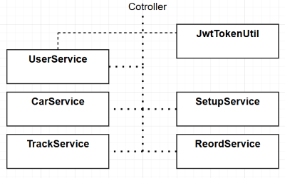
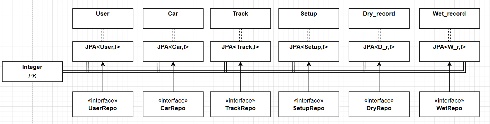
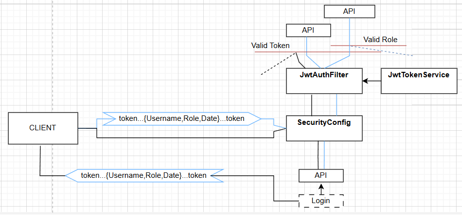

# RACELOG:  Tieni Traccia dei tuoi tempi su ACC
## Terzo Assigment di PSS
### Studente: Lorenzo Pittiglio mtr. 885893

**Racelog** è stato realizzato con lo scopo di tenere traccia dei migliori tempi  sul giro personali, realizzati sul  simulatore
di guida *Assetto Corsa Competizione*. Permette il confronto anche tramite grafici con tutti i giocatori registrati.
### Guida all'avvio ###
- **DATABASE**:  il progetto è  stato realizzato per interagire con MySQL, dunque effettuare un dump dello schema in locale (/dumps/..).
  - All'interno del file **application.properties**  modificare `datasource`,  `username`  e `password` riportando rispettivamente la stringa di connessione al db locale e la relativa utenza.
-  **SERVER**:  necessario avere la corretta versione di Java installata `(JDK23)`.
  - Posizionarsi nella sottocartella `RaceLog_B` per avviare il  server tomcat tramite mavene springboot.
-  **CLIENT**: richiede l'utilizzo di angular, dunque è necessaria l'installazione di `NodeJS` prima e della CLI di Angular tramite comando `npm install -g @angular/cli`
  - Posizionarsi nella sottocartella 'RaceLog_f' (cmd o altra istanza IDE) e digitare `ng serve --open' per avviare direttamente il client sulla porta di default
  4200`
  - NOTA BENE: il sistema presenta un unico admin di default e alcuni utenti già presenti:
    - U: **Admin** Psw: **admin**
    - U:  **Pitti** Psw:  **1234**
### Tecnologia e Struttura
Il progetto adotta il pattern `MVC`  separando la logica dai dati e dalla visualizzazione.

- **SERVER:**  il  server è realizzato in Java tramite Framework `@Spring`.    
#### RestController ####
Esso espone tutte le API tramite le relative 
interfacce implementate dalle classi adibite alla funzione di **Controller** `@Controller`, così schematizzate:   
  
  I metodi delle classi sono preceduti dalle rispettive notazioni Spring per indicare la tipologia di API che costituiscono:  
  - `@GetMapping`
  - `@PostMapping`
  - `@DeleteMapping`

#### Service ####
  Scendendo di livello nell'architettura si trovano le classi di servizio `@Service` che svolgono il lavoro di controllo,
manipolazione ed esecuzione della logica dell'applicazione. Esse sono sia indipendenti che dipendenti tra di loro tramite i metodi
definiti `public`.  
  
#### Repository JPA ####
Sotto ai servizi,  infine, sono presenti le repository `@Repository`, nello specifico le JPA, che si interpongono tra l'applicazione
e il DataBase. Hanno il compito di eseguire tutte le opeazioni **CRUD** astraendo il linguaggio della base dati, rendendo cosi
possibile creare, leggere, aggiornare e cancellare dati con semplici istruzioni java.  
Ciascuna repository si occupa di una specifica e unica tabella, appoggiandosi ad una sua rappresentazione fatta tramite le classi
denominate Entity `@Entity`  

#### SpringSecurity ####
Un'implementazione importante di Spring fatta in questo progetto, è stata quella di sicurezza `@SpringSecurity`.
Nel dettaglio, sono state implementate delle classi adibite al generare e verificare un **token** univoco per ogni  sessione, introducendo  un
maggior livello di sicurezza nel server.
  - `SecurityConfig` annotata da `@Configuration, @EnableWebSecurity, @EnableMethodSecurity(prePostEnabled = true)`: questa classe ha il compito di stabilire quali API 
  necessitino dell'autenticazione per essere richiamate e quali non. Nello specifico, per ovvi motivi, tutte le API richiamabili da un utente non  registrato  nel sistema sono escluse
  dalla tokenizzazione  (login, signup...).
  - `JwtAuthFilter`, annotata da `@Configuration, @EnableWebSecurity`:  ha il compito di filtrare ogni chiamata proveniente dall'esterno, analizzandone l'**header**,  estrando  il  **token**
  e catalogando il **ruolo** del   chiamante (Admin, User).
  - `JwtTokenService`, `@Service`: svolge le operazioni effettive di creazione ed analisi dei token. Crea un token univoco criptandolo  con **chiave privata**, inserendo come informazioni
  l'username, il ruolo e la data di scadenza al momento del login. Per decriptare un  token  passatogli dalla classe JwtAuthFilter, usa una chiave **pubblica** e analizza i valori.
  
  E' importante sottolineare che qualsiasi **endpoint** non  escluso dall'autenticazione nella classe SecurityConfig, se non  riceve un   header contenente
un token valido  non  permette l'esecuzione dell'API.  
Infine, solo  le API annotate da `@PreAuthorize("hasRole('*RUOLO*')")`, con  *ruolo* = {`ADMIN`, `USER`} necessitano del corrispondende ruolo  all'interno del token per essere eseguite.  
*(Un utente loggato che non ha i  permessi da  ammministratore non potrà accedere 
alle API con ruolo richiesto  =  ADMIN)*

- **CLIENT** :  il client è stato realizzato in typescript tramite il framework `Angular`. Esso comunica con le API del server
tramite un componente adibto nell'inviare richieste e nel ricevere le relative risposte.